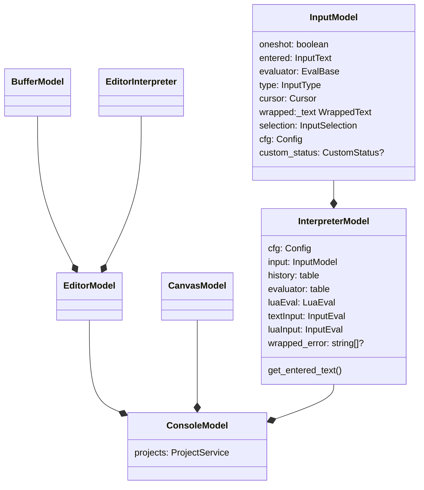
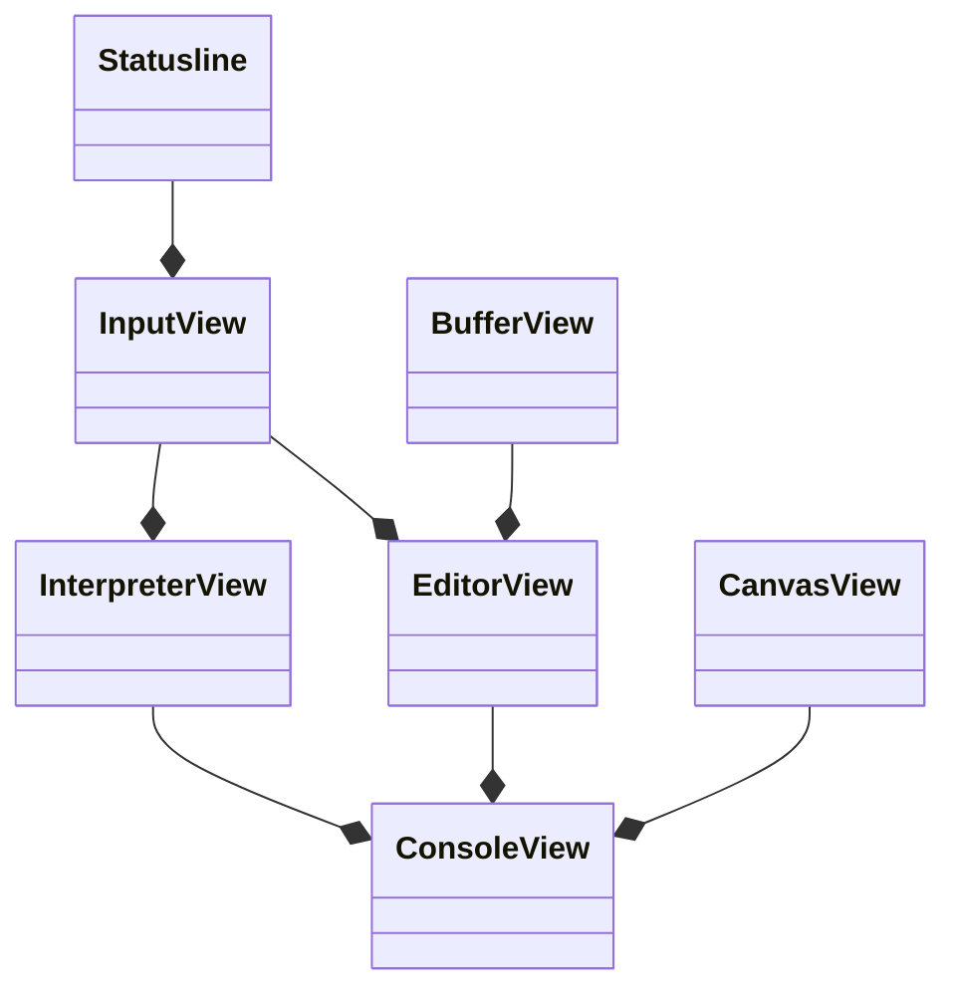
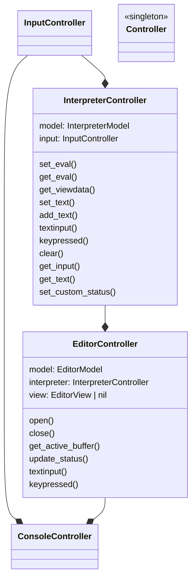
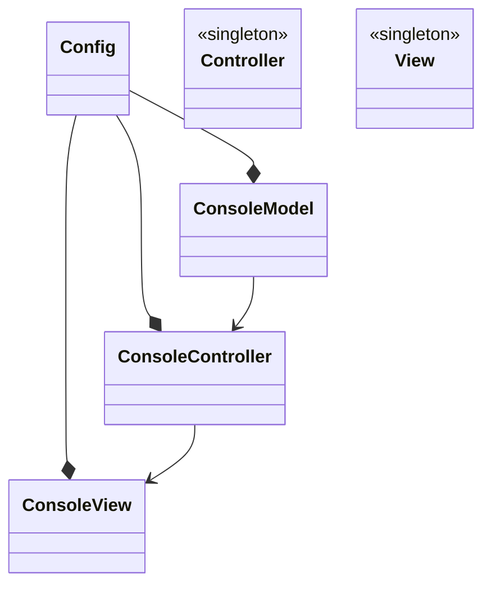

### Model

```mermaid
classDiagram

BufferModel --* EditorModel
EditorInterpreter --* EditorModel
EditorModel --* ConsoleModel
%% EditorInterpreter --|> InterpreterBase

class ConsoleModel {
   projects: ProjectService
}
class InputModel {
  oneshot: boolean
  entered: InputText
  evaluator: EvalBase
  type: InputType
  cursor: Cursor
  wrapped:_text WrappedText
  selection: InputSelection
  cfg: Config
  custom_status: CustomStatus?

}
class InterpreterModel {
  cfg: Config
  input: InputModel
  history: table
  evaluator: table
  luaEval: LuaEval
  textInput: InputEval
  luaInput: InputEval
  wrapped_error: string[]?

  get_entered_text()
}
InputModel --* InterpreterModel
CanvasModel --* ConsoleModel
InterpreterModel --* ConsoleModel
%% InterpreterModel --|> InterpreterBase
%% EvalBase --> InterpreterModel


%% class View {
%%   prev_draw: function&
%% }
%% InputView --* InterpreterView
%% InterpreterView --* View
```

### View

```mermaid
classDiagram

Statusline --* InputView
InputView --* InterpreterView
InterpreterView --* ConsoleView
EditorView --* ConsoleView
CanvasView --* ConsoleView
BufferView --* EditorView
InputView --* EditorView
%% InterpreterView --* EditorView
```

### Controller

```mermaid
classDiagram

class InterpreterController {
  model: InterpreterModel
  input: InputController

  set_eval()
  get_eval()
  get_viewdata()
  set_text()
  add_text()
  textinput()
  keypressed()
  clear()
  get_input()
  get_text()
  set_custom_status()
}

class EditorController {
  model: EditorModel
  interpreter: InterpreterController
  view: EditorView | nil

  open()
  close()
  get_active_buffer()
  update_status()
  textinput()
  keypressed()
}

InputController --* ConsoleController
InputController --* InterpreterController
InterpreterController --* EditorController
EditorController --* ConsoleController

class Controller {
  <<singleton>>
}
```

### MVC

```mermaid
classDiagram

Config --* ConsoleModel
Config --* ConsoleController
Config --* ConsoleView
ConsoleModel --> ConsoleController
ConsoleController --> ConsoleView

class Controller {
  <<singleton>>
}
class View {
  <<singleton>>
}
```
