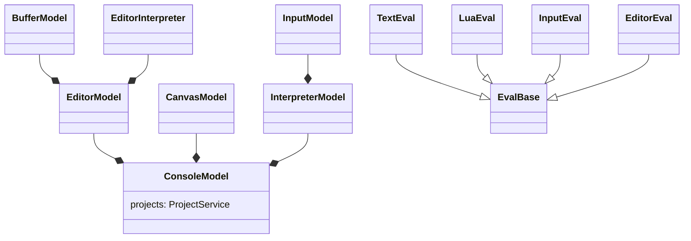
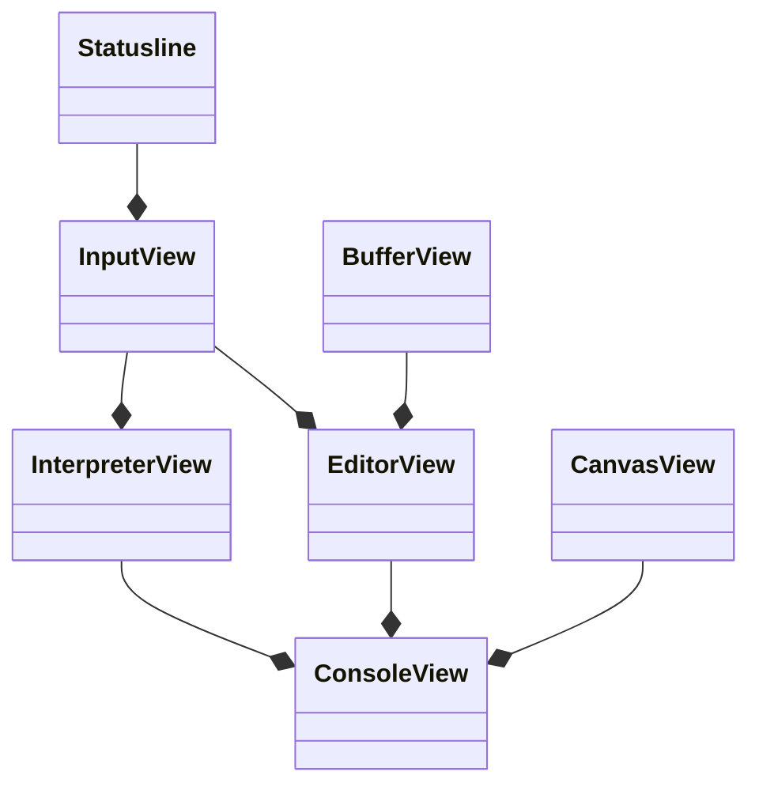
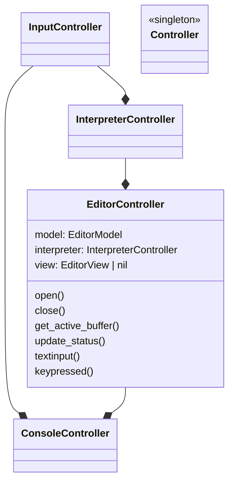
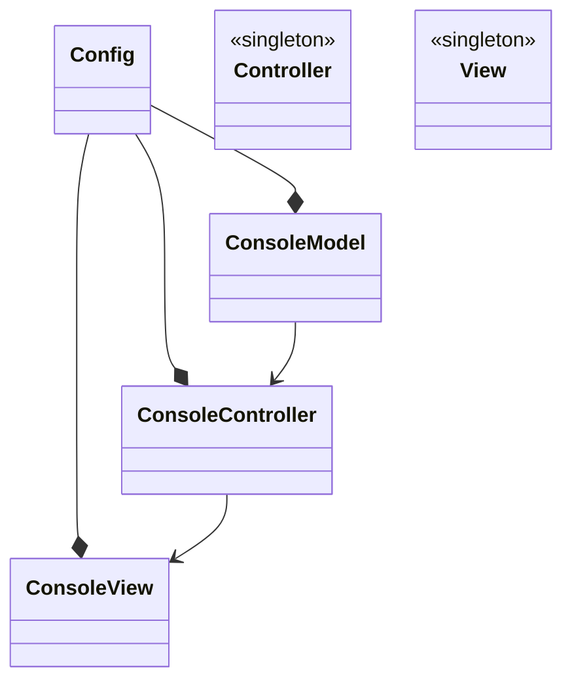

### Model

```mermaid
classDiagram

BufferModel --* EditorModel
EditorInterpreter --* EditorModel
EditorModel --* ConsoleModel
%% EditorInterpreter --|> InterpreterBase

class ConsoleModel {
   projects: ProjectService
}
InputModel --* InterpreterModel
CanvasModel --* ConsoleModel
InterpreterModel --* ConsoleModel
%% InterpreterModel --|> InterpreterBase
class EvalBase
TextEval --|> EvalBase
LuaEval --|> EvalBase
InputEval --|> EvalBase
EditorEval --|> EvalBase
%% EvalBase --> InterpreterModel


%% class View {
%%   prev_draw: function&
%% }
%% InputView --* InterpreterView
%% InterpreterView --* View
```

### View

```mermaid
classDiagram

Statusline --* InputView
InputView --* InterpreterView
InterpreterView --* ConsoleView
EditorView --* ConsoleView
CanvasView --* ConsoleView
BufferView --* EditorView
InputView --* EditorView
%% InterpreterView --* EditorView
```

### Controller

```mermaid
classDiagram

class EditorController {
  model: EditorModel
  interpreter: InterpreterController
  view: EditorView | nil

  open()
  close()
  get_active_buffer()
  update_status()
  textinput()
  keypressed()
}

InputController --* ConsoleController
InputController --* InterpreterController
InterpreterController --* EditorController
EditorController --* ConsoleController

class Controller {
  <<singleton>>
}
```

### MVC

```mermaid
classDiagram

Config --* ConsoleModel
Config --* ConsoleController
Config --* ConsoleView
ConsoleModel --> ConsoleController
ConsoleController --> ConsoleView

class Controller {
  <<singleton>>
}
class View {
  <<singleton>>
}
```
