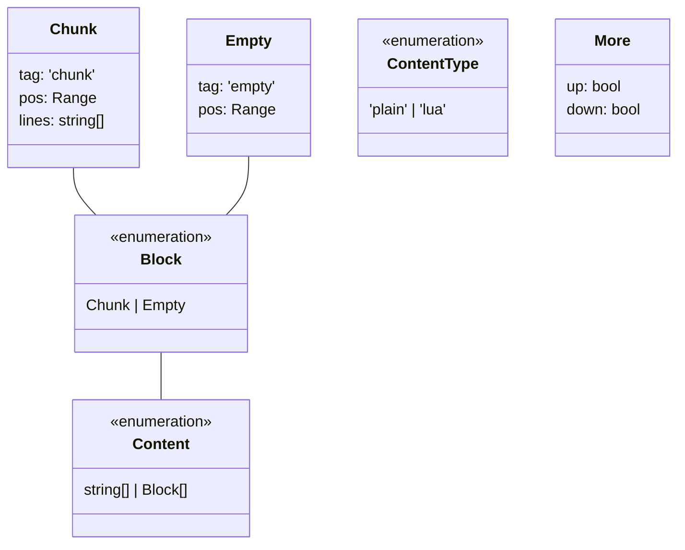
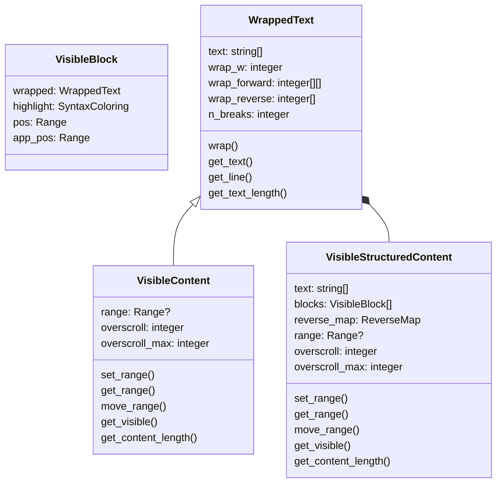
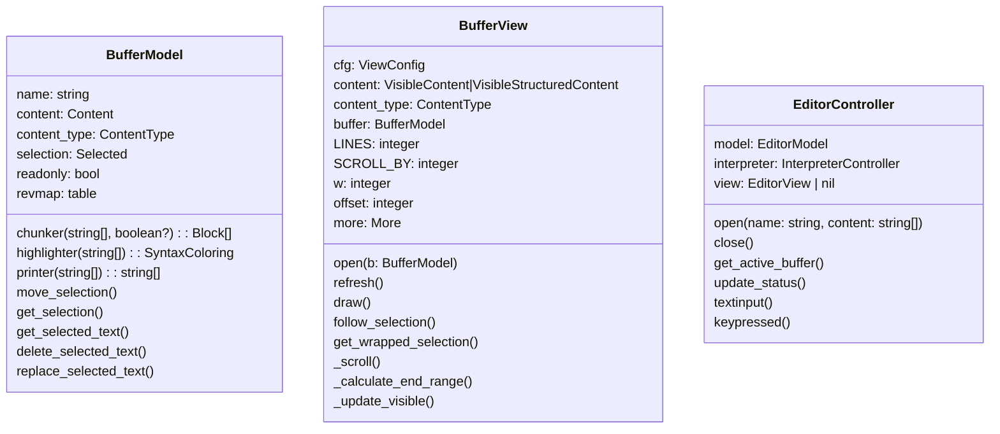
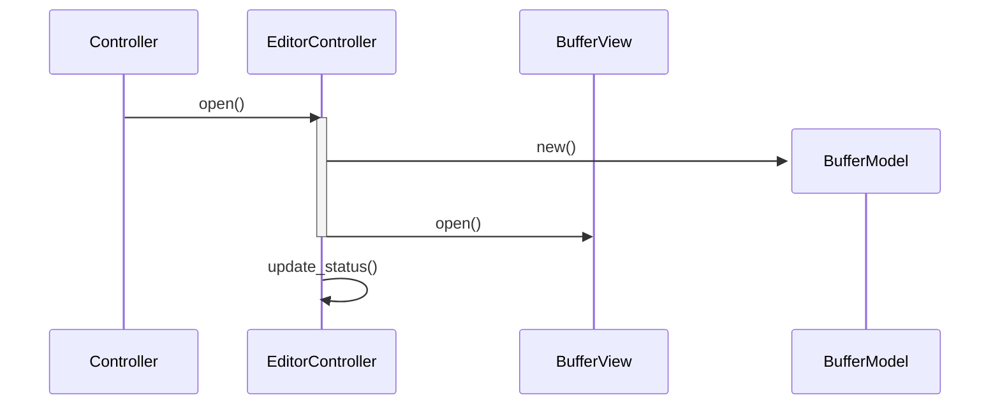
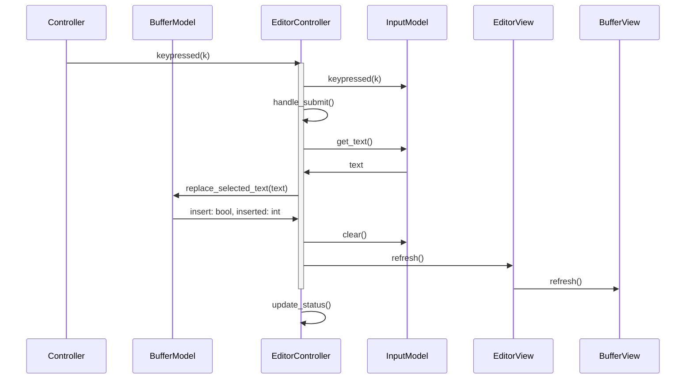

### Editor data structures

```mermaid
classDiagram

class Empty {
  tag: 'empty'
  pos: Range
}
class Chunk {
  tag: 'chunk'
  pos: Range
  lines: string[]
}
class Block {
<<enumeration>>
  Chunk | Empty
}
Chunk -- Block
Empty -- Block


class Content {
<<enumeration>>
  string[] | Block[]
}
Block -- Content
class ContentType {
<<enumeration>>
  'plain' | 'lua'
}

class More {
  up: bool
  down: bool
}
```

```mermaid
classDiagram

class VisibleBlock {
  wrapped: WrappedText
  highlight: SyntaxColoring
  pos: Range
  app_pos: Range
}

class WrappedText {
  text: string[]
  wrap_w: integer
  wrap_forward: integer[][]
  wrap_reverse: integer[]
  n_breaks: integer

  wrap()
  get_text()
  get_line()
  get_text_length()
}

class VisibleContent {
  range: Range?
  overscroll: integer
  overscroll_max: integer

  set_range()
  get_range()
  move_range()
  get_visible()
  get_content_length()
}

class VisibleStructuredContent {
  text: string[]
  blocks: VisibleBlock[]
  reverse_map: ReverseMap

  range: Range?
  overscroll: integer
  overscroll_max: integer

  set_range()

  get_range()
  move_range()
  get_visible()
  get_content_length()
}

WrappedText <|-- VisibleContent
WrappedText *-- VisibleStructuredContent
%% BufferModel --o BufferView

```

```mermaid
classDiagram

class BufferModel {
  name: string
  content: Content
  content_type: ContentType
  selection: Selected
  readonly: bool
  revmap: table

  chunker(string[], boolean?): Block[]
  highlighter(string[]): SyntaxColoring
  printer(string[]): string[]
  move_selection()
  get_selection()
  get_selected_text()
  delete_selected_text()
  replace_selected_text()
}

class BufferView {
  cfg: ViewConfig

  content: VisibleContent|VisibleStructuredContent
  content_type: ContentType
  buffer: BufferModel

  LINES: integer
  SCROLL_BY: integer
  w: integer
  offset: integer
  more: More

  open(b: BufferModel)
  refresh()
  draw()
  follow_selection()
  get_wrapped_selection()

  _scroll()
  _calculate_end_range()
  _update_visible()
}

class EditorController {
  model: EditorModel
  interpreter: InterpreterController
  view: EditorView | nil

  open(name: string, content: string[])
  close()
  get_active_buffer()
  update_status()
  textinput()
  keypressed()
}

```

### Flow

#### open

```mermaid
sequenceDiagram

participant Controller
Controller->>EditorController: open()
activate EditorController
participant EditorController

create participant BufferView

create participant BufferModel
EditorController->>BufferModel: new()

EditorController->>BufferView: open()

deactivate EditorController
EditorController->>EditorController: update_status()
```

#### submit

```mermaid
sequenceDiagram

participant Controller
participant BufferModel
participant EditorController
participant InputModel
participant EditorView
participant BufferView

Controller->>EditorController: keypressed(k)
activate EditorController
EditorController->>InputModel: keypressed(k)
EditorController->>EditorController: handle_submit()
EditorController->>InputModel: get_text()
InputModel->>EditorController: text

EditorController->>BufferModel: replace_selected_text(text)
BufferModel->>EditorController: insert: bool, inserted: int
EditorController->>InputModel: clear()
EditorController->>EditorView: refresh()
EditorView->>BufferView: refresh()


deactivate EditorController
EditorController->>EditorController: update_status()

```
