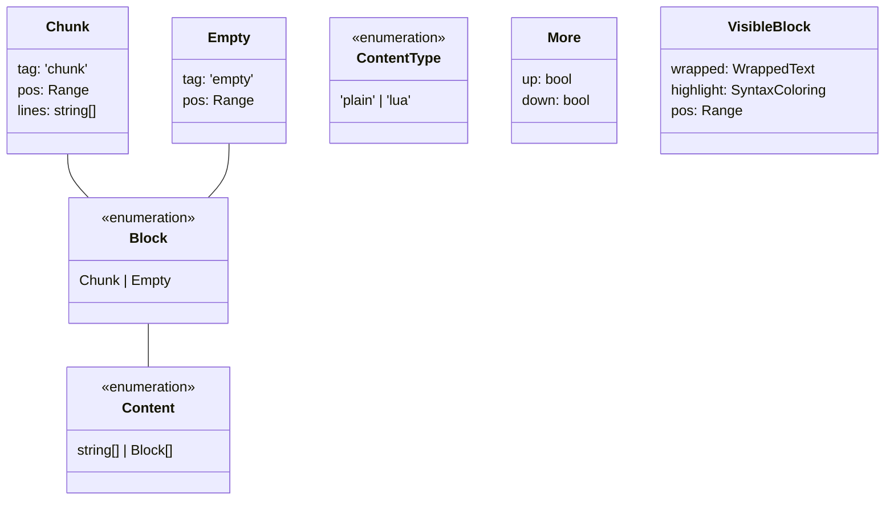
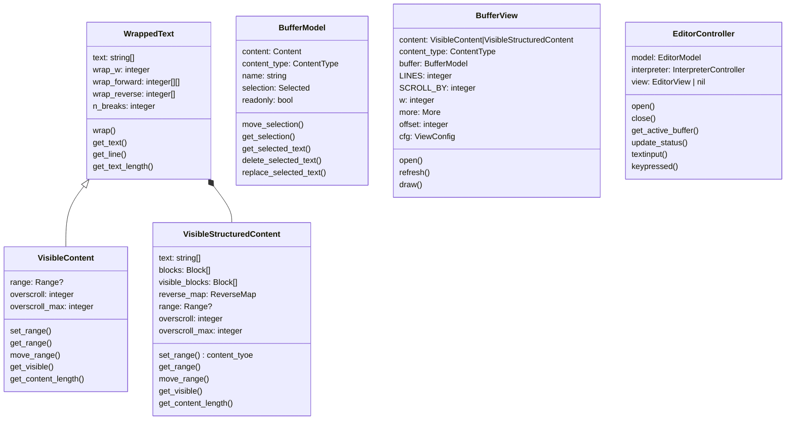

### Editor data structures

```mermaid
classDiagram

class Empty {
  tag: 'empty'
  pos: Range
}
class Chunk {
  tag: 'chunk'
  pos: Range
  lines: string[]
}
class Block {
<<enumeration>>
  Chunk | Empty
}
Chunk -- Block
Empty -- Block


class Content {
<<enumeration>>
  string[] | Block[]
}
Block -- Content
class ContentType {
<<enumeration>>
  'plain' | 'lua'
}

class More {
  up: bool
  down: bool
}

class VisibleBlock {
  wrapped: WrappedText
  highlight: SyntaxColoring
  pos: Range
}
```

```mermaid
classDiagram

class WrappedText {
  text: string[]
  wrap_w: integer
  wrap_forward: integer[][]
  wrap_reverse: integer[]
  n_breaks: integer

  wrap()
  get_text()
  get_line()
  get_text_length()
}

class VisibleContent {
  range: Range?
  overscroll: integer
  overscroll_max: integer

  set_range()
  get_range()
  move_range()
  get_visible()
  get_content_length()
}

class VisibleStructuredContent {
  text: string[]
  blocks: Block[]
  visible_blocks: Block[]
  reverse_map: ReverseMap

  range: Range?
  overscroll: integer
  overscroll_max: integer

  set_range()content_tyoe

  get_range()
  move_range()
  get_visible()
  get_content_length()
}

WrappedText <|-- VisibleContent
WrappedText *-- VisibleStructuredContent
%% BufferModel --o BufferView

class BufferModel {
  content: Content
  content_type: ContentType

  name: string
  selection: Selected
  readonly: bool

  move_selection()
  get_selection()
  get_selected_text()
  delete_selected_text()
  replace_selected_text()
}

class BufferView {
  content: VisibleContent|VisibleStructuredContent
  content_type: ContentType
  buffer: BufferModel
  LINES: integer
  SCROLL_BY: integer
  w: integer
  more: More
  offset: integer
  cfg: ViewConfig

  open()
  refresh()
  draw()
}

class EditorController {
model: EditorModel
interpreter: InterpreterController
view: EditorView | nil

open()
close()
get_active_buffer()
update_status()
textinput()
keypressed()
}

```
