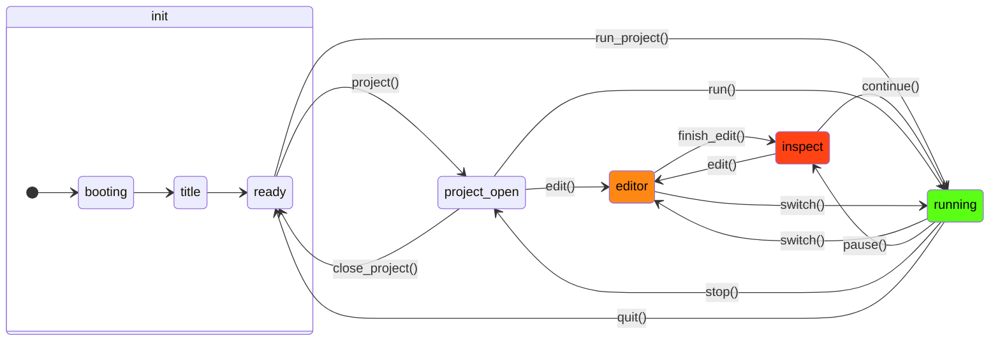

```mermaid
stateDiagram-v2
  direction LR

  classDef editorStyle fill:#FF8815, color:#000;
  class editor editorStyle
  classDef inspectStyle fill:#FF4315, color:#000;
  class inspect inspectStyle
  classDef runStyle fill:#5BFF15, color:#000;
  class running runStyle

  %% linkStyle default stroke:red
  %% linkStyle 0 stroke-width:4px,stroke:green
  %% linkStyle 3 stroke:blue
  %% linkStyle 4 stroke:blue

  state init {
    [*] --> booting
    booting --> title
    title --> ready
  }
  ready --> project_open     : project()
  ready --> running          : run_project()
  running --> editor         : switch()
  inspect --> running        : continue()
  editor --> inspect         : finish_edit()
  running --> inspect        : pause()
  running --> project_open   : stop()
  running --> ready          : quit()
  project_open --> ready     : close_project()
  project_open --> editor    : edit()
  project_open --> running   : run()
  inspect --> editor         : edit()
  editor  --> running        : switch()
```
