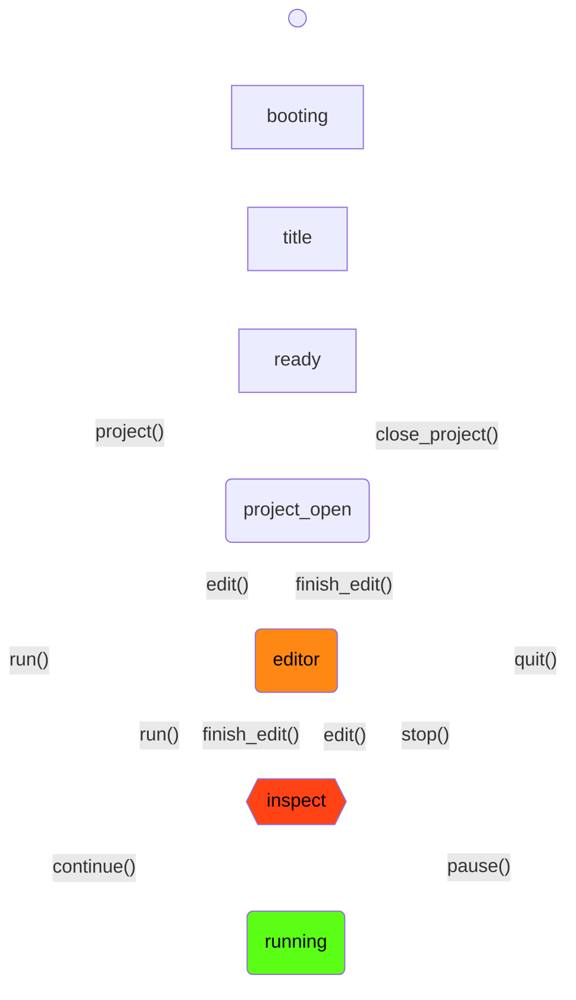

```mermaid
flowchart TD
  id1(( ))      --> booting
  booting       --> title
  title         --> ready
  ready         -- project() --> O(project_open)
  ready         -- run() --> R
  I{{inspect}}  -- continue() --> R
  O             -- close_project() --> ready
  O             -- edit() --> E
  O             -- run() ----> R
  E(editor)     -- finish_edit() --> I
  E             -- finish_edit() --> O
  I             -- edit() --> E
  R             -- stop() --> O
  R(running)    -- pause() --> I
  R             -- quit() --> ready

  classDef editorStyle fill:#FF8815, color:#000;
  classDef inspectStyle fill:#FF4315, color:#000;
  classDef runStyle fill:#5BFF15, color:#000;
  class E editorStyle;
  class I inspectStyle;
  class R runStyle;

  linkStyle default stroke:white
  %% linkStyle 4,8 stroke:green
  %% linkStyle 13 stroke:red
  %% linkStyle 5 stroke:firebrick
  %% linkStyle 8,12 stroke:orange
  %% linkStyle 10,11 stroke:darkorange

```
