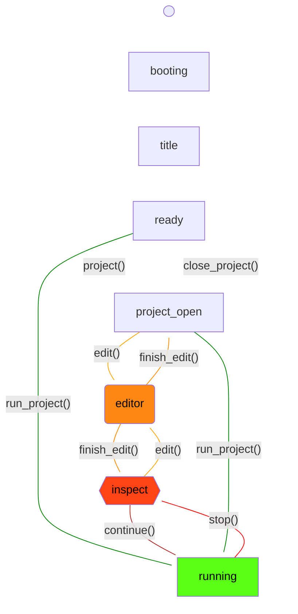

```mermaid
flowchart TD
  id1(( ))           --> booting
  booting            --> title
  title              --> ready
  ready              -- project() --> project_open
  ready              -- run_project() --> running
  %% running            -- asd ---> project_open
  running            -- stop() --> inspect
  inspect{{inspect}} -- continue() --> running
  project_open       -- close_project() --> ready
  project_open       -- edit() --> editor
  project_open       -- run_project() ----> running
  editor(editor)     -- finish_edit() --> inspect
  editor             -- finish_edit() --> project_open
  inspect            -- edit() --> editor
  running            --> ready

  classDef editorStyle fill:#FF8815, color:#000;
  classDef inspectStyle fill:#FF4315, color:#000;
  classDef runStyle fill:#5BFF15, color:#000;
  class editor editorStyle;
  class inspect inspectStyle;
  class running runStyle;

  linkStyle default stroke:white
  linkStyle 4,9 stroke:green
  linkStyle 5 stroke:red
  linkStyle 6 stroke:firebrick
  linkStyle 8,12 stroke:orange
  linkStyle 10,11 stroke:darkorange

```
